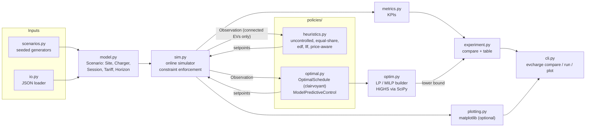

# ev-smart-charging

[](https://github.com/houssammehdi/ev-smart-charging/actions/workflows/ci.yml)
[](LICENSE)
[](pyproject.toml)

**Smart-charging policies for EV sites that have more chargers than grid capacity.** A car park
with forty 11 kW chargers behind a 60 kW connection has to decide, every 15 minutes, which EVs
charge and how fast. `evcharge` is a Python library and CLI that answers that question in several
ways and scores them side by side. It includes the real-time heuristics used in load-management
products (first come first served, equal share, earliest deadline first, least laxity first,
price-aware valley filling), a perfect-foresight optimum formulated as an LP/MILP, and a
rolling-horizon MPC controller that sees only EVs that have already plugged in. They all run on
one reproducible discrete-time simulator that models the physics that matter in practice: the
IEC 61851 6 A minimum current, charger and on-board-charger limits, charging losses, base load,
PV, time-of-use prices and a demand charge on peak import.

## Features

- **Domain model with validation**: sites, chargers (max/min power), sessions (arrival,
  departure, requested energy, EV limit, efficiency), time-of-use tariffs with export prices and a
  demand charge, base load and PV series. Invalid input fails early with a message that names
  the problem.
- **Seven policies behind one protocol**: `uncontrolled`, `equal-share`, `edf`, `llf`,
  `price-aware`, `mpc`, `optimal`. A custom policy is a class with one `decide()` method.
- **Exact optimisation**: the LP/MILP is solved with HiGHS through `scipy.optimize.linprog` and
  `scipy.optimize.milp`. The minimum current is modelled as a semi-continuous variable, and every
  comparison reports a certified **LP lower bound**.
- **Online MPC**: re-optimises every step using only the EVs that have arrived. It prices peak
  import against the peak already incurred and needs at most one binary per connected EV.
- **Enforcing simulator**: arrivals are revealed online, and commands are checked against
  physics and site limits. Corrections are recorded as violations; all built-in policies produce
  none, and property tests verify it.
- **KPIs**: delivered energy, unmet kWh, completed sessions, energy cost, peak import, demand
  charge, total cost, gap to the lower bound, Jain's fairness index, capacity utilisation and
  load factor.
- **Offline synthetic scenarios** (`workplace`, `depot`, `residential`) with a Nordic
  day-ahead-like price shape and optional PV, all seeded and reproducible.
- **CLI**: `evcharge compare`, `evcharge run --input sessions.json` and `evcharge plot`.
- Typed (`mypy --strict`), linted and formatted with `ruff`, and tested with `pytest` and
  `hypothesis`.

## Quickstart

```bash
git clone https://github.com/houssammehdi/ev-smart-charging.git
cd ev-smart-charging
python -m venv .venv && source .venv/bin/activate
pip install -e ".[plot]"        # runtime: numpy + scipy; [plot] adds matplotlib

evcharge compare --scenario workplace --sessions 40 --seed 7 --grid-limit 60
```

Everything runs offline. HiGHS ships inside SciPy.

## Usage

### CLI

```bash
# compare all policies on a synthetic scenario (table or --format json)
evcharge compare --scenario depot --sessions 40 --seed 7
evcharge compare --scenario workplace --grid-limit 30 --pv-kwp 40 --policies llf mpc optimal

# your own site and sessions (format: docs/input-format.md)
evcharge run --input examples/office.json

# stacked power plot per policy (needs the [plot] extra)
evcharge plot --scenario residential --policies uncontrolled price-aware mpc optimal \
    --output docs/residential.png
```

Scenario options: `--scenario {workplace,depot,residential}`, `--sessions`, `--seed`,
`--grid-limit` (kW), `--step-minutes`, `--pv-kwp`, `--base-load-peak` (kW) and
`--demand-charge` (EUR/kW). The JSON input format is documented in
[docs/input-format.md](docs/input-format.md), with a complete example in
[examples/office.json](examples/office.json).

### Python

```python
from evcharge import compute_metrics, scenarios, simulate
from evcharge.policies import ModelPredictiveControl, OptimalSchedule

sc = scenarios.workplace(n_sessions=40, seed=7, grid_limit_kw=60)
for policy in (ModelPredictiveControl(), OptimalSchedule()):
    m = compute_metrics(simulate(sc, policy))
    print(f"{m.policy:8s} total {m.total_cost_eur:6.2f} EUR  peak {m.peak_import_kw:5.1f} kW")
```

```text
mpc      total  58.71 EUR  peak  46.1 kW
optimal  total  58.03 EUR  peak  39.7 kW
```

### Writing a policy

```python
from collections.abc import Mapping

from evcharge.policies import Observation, OnlinePolicy
from evcharge.policies.base import priority_fill


class LargestRemainingFirst(OnlinePolicy):
    """Serve the EV with the most energy still to go first."""

    name = "largest-remaining"

    def decide(self, obs: Observation) -> Mapping[str, float]:
        order = sorted(obs.pending(), key=lambda s: -s.remaining_kwh)
        return priority_fill(order, obs.headroom_kw)  # respects headroom and 6 A minimum
```

`simulate(scenario, LargestRemainingFirst())` then runs it, and the result's `violations` list
shows every command the simulator had to correct.

## Architecture



The simulator is the only component that sees future sessions. It passes the full scenario only
to policies that declare `clairvoyant = True` (the offline optimum). Every other policy gets the
scenario with its sessions removed and learns about each EV only when it plugs in.

| module          | responsibility                                                            |
|-----------------|---------------------------------------------------------------------------|
| `model.py`      | frozen, validated dataclasses; time grid; effective power bounds          |
| `policies/`     | `Policy` protocol, `Observation`/`SessionState`, allocation helpers, policies |
| `optim.py`      | sparse LP/MILP matrices, `exact` and `relax-and-fix` strategies, lower bound |
| `sim.py`        | step loop, online reveal, command enforcement, violation log              |
| `metrics.py`    | cost, peak, delivery, fairness, utilisation                               |
| `scenarios.py`  | workplace / depot / residential generators, price and PV profiles         |
| `io.py`         | JSON scenario loader with field-level error messages                      |
| `experiment.py`, `cli.py`, `plotting.py` | comparison table, command line, figures          |

## Physical model

- **Time**: steps of `step_minutes` (default 15, the settlement period of the Nordic power
  markets). Power is the *average* over a step.
- **Charging window**: an EV can charge in steps `arrival_step <= t < departure_step`. The JSON
  loader rounds plug-in times up and plug-out times down to the step grid.
- **Power range**: `p_max = min(charger max, EV max)`. A charging EV must draw at least `p_min`,
  the IEC 61851 minimum of 6 A (4.14 kW on three phases, 1.38 kW on one phase). An EV is
  therefore either paused or charging within `[p_min, p_max]`.
- **Losses**: drawing `p` kW for `dt` hours adds `efficiency * p * dt` kWh to the battery. The
  energy request is measured in the battery and the grid pays for the losses.
- **EV stops when full**: the EV draws `min(command, power that completes its request)`. Sending
  `p_min` to finish the last few hundred Wh is legal and physically accurate, and an EV never
  receives more energy than it requested.
- **Site**: `import = base load - PV + sum of EV power`, limited to `grid_limit_kw`. Negative
  import is export and earns the export price.
- **Enforcement**: the simulator corrects commands and logs each correction as a `Violation`.
  Negative or NaN commands are set to 0, commands for EVs that are not connected are ignored,
  commands above `p_max` are clipped, commands below `p_min` pause the charger (0 kW), and if the
  total exceeds the headroom all commands are scaled down proportionally.

## Policies

| policy         | knows                                         | rule                                                           |
|----------------|-----------------------------------------------|----------------------------------------------------------------|
| `uncontrolled` | connected EVs                                 | full power on plug-in; when the limit is hit, earlier arrivals keep full power (static load balancer, FCFS) |
| `equal-share`  | connected EVs                                 | water-filling split of the headroom. If not every EV can get `p_min`, the least-served EVs are admitted first, so access rotates |
| `edf`          | connected EVs + declared departures           | earliest departure first, each up to full power                |
| `llf`          | + declared energy                             | least laxity first; laxity = time left - time needed at `p_max` |
| `price-aware`  | + price, base-load and PV forecasts           | re-planned every step: EVs in least-laxity order book the cheapest *free* capacity in their window (valley filling). PV-surplus steps are valued at the export price |
| `mpc`          | + everything declared so far                  | solves the LP below from now to the last known departure and applies only the first step |
| `optimal`      | **all sessions in advance** (clairvoyant)     | one LP/MILP over the whole horizon, replayed. This is the benchmark, not a deployable controller |

All heuristics share `priority_fill` and `water_fill`, which never exceed the headroom and
never command a non-zero power below `p_min`.

## Optimisation model

For sessions $s$ with window $\mathcal{T}_s = \lbrace a_s, \dots, d_s - 1 \rbrace$, step length
$\Delta t$, import and export prices $\pi_t \ge \pi^{\mathrm{exp}}_t$, demand charge $D$, base
load $B_t$, PV $V_t$, grid limit $L$, efficiency $\eta_s$, requested energy $E_s$, power bounds
$\underline{p}_s \le \overline{p}_s$ and unmet-energy penalty $\rho$:

$$
\begin{aligned}
\min_{p,\,g,\,e,\,P,\,u,\,o,\,y}\quad
  & \sum_{t} \Delta t \left( \pi_t\, g_t - \pi^{\mathrm{exp}}_t\, e_t \right) + D\,P + \rho \sum_s u_s + \sum_s \kappa_s\, o_s \\
\text{s.t.}\quad
  & g_t - e_t = B_t - V_t + \sum_{s} p_{s,t} && \forall t \quad \text{(power balance)}\\
  & \sum_{s} p_{s,t} \le L - B_t + V_t && \forall t \quad \text{(grid limit)}\\
  & g_t \le P, \qquad P \ge P_0 && \forall t \quad \text{(peak import)}\\
  & \sum_{t \in \mathcal{T}_s} \eta_s\, p_{s,t}\, \Delta t + u_s - o_s = E_s && \forall s \quad \text{(energy)}\\
  & \underline{p}_s\, y_{s,t} \le p_{s,t} \le \overline{p}_s\, y_{s,t},\quad y_{s,t} \in \lbrace 0, 1 \rbrace && \forall s,\ t \in \mathcal{T}_s \quad \text{(6 A minimum)}\\
  & 0 \le u_s \le E_s, \qquad 0 \le o_s \le \eta_s\, \underline{p}_s\, \Delta t, \qquad g_t, e_t \ge 0 &&
\end{aligned}
$$

- $p_{s,t}$ exists only inside the window, which enforces availability. The bound
  $p_{s,t} \le \overline{p}_s$ covers both the charger and the EV limit.
- $u_s$ is unmet energy. $\rho = 100$ EUR/kWh is far above the marginal cost of a kWh
  ($\pi_t + D / (\eta \Delta t)$), so the optimiser delivers everything it physically can before
  it looks at cost.
- $o_s$ is *overshoot*: a command of $\underline{p}_s$ may finish a request of less than one
  minimum step, because the EV stops by itself. Overshoot energy is commanded but never drawn.
  It is paid for at the import price and, in addition, at
  $\kappa_s = \max(0, -\min_{t \in \mathcal{T}_s} \pi^{\mathrm{exp}}_t) / \eta_s$, so that
  undrawn energy can never count as revenue when export prices are negative. The MILP objective
  is then an upper bound on the cost of replaying its plan in the simulator.
- Drop the $y$ constraints ($\underline{p}_s = 0$) and the problem is an LP. With $P_0 = 0$, its
  optimum is a **lower bound** on the penalised cost
  $\text{energy} + \text{demand} + \rho \cdot \text{unmet}$ of *any* schedule the simulator can
  execute, because every executed schedule is feasible for it. The `gap %` column is measured
  against this bound.
- **Strategies for the MILP**. `exact` puts binaries on every entry. `relax-and-fix` (the
  default for `optimal`) solves the LP, fixes each entry the LP left at 0 (off) or at
  $\ge \underline{p}_s$ (on), and runs a small MILP over the remaining fractional entries. It is
  a heuristic, but the LP gives it a certified gap. On the four result instances below it
  needs about 30 binaries and 0.3 s, and the gap to the LP bound is at most 0.05 %.

**MPC.** At step $k$ the same model is solved over the connected sessions, with remaining
energy as $E_s$, from $k$ to the last declared departure. The peak floor is
$P_0 = \max(\text{peak so far}, \max_{t \ge d_{\max}} (B_t - V_t))$, so only a *new* peak costs
demand charge. Binaries are used only for step $k$ (the one that is applied). The objective adds
a small "quick-charge" regulariser $w \sum_{s,t} (t-k)\,\Delta t \cdot p_{s,t} \Delta t$ with
$w = 0.002$ EUR/kWh per hour of delay, similar to the quick-charge term of the Caltech Adaptive
Charging Network scheduler. The regulariser hedges against arrivals the controller cannot see.
With perfect information and $w = 0$, the MPC reproduces the offline optimum (Bellman's
principle), and a property test checks this.

## Results

The numbers below are pasted from runs of the commands shown, at commit time, with seed 7. The
scenarios are seeded and HiGHS is deterministic, so the same package versions reproduce them
exactly. Each command takes about 2 to 4 s in the development container. Costs are site-level:
they include the base load, so the differences between rows are what matter. `gap %` is the
penalised cost above the LP lower bound.

**Workplace**: 40 EVs, arrivals mostly 07:00 to 09:30, about 8 h dwell, 60 kW connection:

```text
$ evcharge compare --scenario workplace --sessions 40 --seed 7 --grid-limit 60
scenario workplace | 40 sessions on 40 chargers | 295.7 kWh requested | grid limit 60.0 kW | base load peak 11.0 kW | 2026-04-15 00:00 + 24 h @ 15 min | demand charge 0.30 EUR/kW

policy        delivered %  unmet kWh  done %  energy EUR  peak kW  demand EUR  total EUR  gap %   Jain  util %  viol
------------  -----------  ---------  ------  ----------  -------  ----------  ---------  -----  -----  ------  ----
uncontrolled       100.00       0.00   100.0       46.30     60.0       18.00      64.30  10.81  1.000    50.9     0
equal-share        100.00       0.00   100.0       46.51     60.0       18.00      64.51  11.17  1.000    50.9     0
edf                100.00       0.00   100.0       46.32     60.0       18.00      64.32  10.84  1.000    50.9     0
llf                100.00       0.00   100.0       46.41     60.0       18.00      64.41  11.00  1.000    50.9     0
price-aware        100.00       0.00   100.0       42.09     60.0       18.00      60.09   3.55  1.000    50.9     0
mpc                100.00       0.00   100.0       44.89     46.1       13.82      58.71   1.17  1.000    50.9     0
optimal            100.00       0.00   100.0       46.12     39.7       11.91      58.03   0.01  1.000    50.9     0

lower bound (LP relaxation, perfect foresight): 58.03 EUR
```

**Depot**: 40 vans back from about 17:00, out again from about 06:00, 45 kWh median request,
22 kW chargers, 240 kW connection:

```text
$ evcharge compare --scenario depot --sessions 40 --seed 7
scenario depot | 40 sessions on 40 chargers | 1807.2 kWh requested | grid limit 240.0 kW | base load peak 21.0 kW | 2026-04-15 12:00 + 24 h @ 15 min | demand charge 0.30 EUR/kW

policy        delivered %  unmet kWh  done %  energy EUR  peak kW  demand EUR  total EUR  gap %   Jain  util %  viol
------------  -----------  ---------  ------  ----------  -------  ----------  ---------  -----  -----  ------  ----
uncontrolled       100.00       0.00   100.0      256.46    240.0       72.00     328.46  22.23  1.000    52.5     0
equal-share        100.00       0.00   100.0      257.49    240.0       72.00     329.49  22.61  1.000    52.5     0
edf                100.00       0.00   100.0      256.01    240.0       72.00     328.01  22.06  1.000    52.5     0
llf                100.00       0.00   100.0      257.86    240.0       72.00     329.86  22.75  1.000    52.5     0
price-aware        100.00       0.00   100.0      203.04    240.0       72.00     275.04   2.35  1.000    52.5     0
mpc                100.00       0.00   100.0      217.95    181.2       54.35     272.30   1.33  1.000    52.5     0
optimal            100.00       0.00   100.0      212.55    187.3       56.18     268.73   0.00  1.000    52.5     0

lower bound (LP relaxation, perfect foresight): 268.73 EUR
```

**Residential**: 40 apartments, arrivals 15:00 to 23:00, departures 06:00 to 09:00, 50 kW
connection shared with the building's base load:

```text
$ evcharge compare --scenario residential --sessions 40 --seed 7
scenario residential | 40 sessions on 40 chargers | 337.9 kWh requested | grid limit 50.0 kW | base load peak 12.3 kW | 2026-04-15 12:00 + 24 h @ 15 min | demand charge 0.30 EUR/kW

policy        delivered %  unmet kWh  done %  energy EUR  peak kW  demand EUR  total EUR  gap %   Jain  util %  viol
------------  -----------  ---------  ------  ----------  -------  ----------  ---------  -----  -----  ------  ----
uncontrolled       100.00       0.00   100.0       60.60     50.0       15.00      75.60  18.38  1.000    51.0     0
equal-share        100.00       0.00   100.0       60.64     50.0       15.00      75.64  18.44  1.000    51.0     0
edf                100.00       0.00   100.0       60.49     50.0       15.00      75.49  18.21  1.000    51.0     0
llf                100.00       0.00   100.0       60.58     50.0       15.00      75.58  18.35  1.000    51.0     0
price-aware        100.00       0.00   100.0       50.65     50.0       15.00      65.65   2.81  1.000    51.0     0
mpc                100.00       0.00   100.0       53.30     39.3       11.78      65.08   1.90  1.000    51.0     0
optimal            100.00       0.00   100.0       52.57     37.7       11.30      63.86   0.00  1.000    51.0     0

lower bound (LP relaxation, perfect foresight): 63.86 EUR
```

**Scarce capacity with PV**: the same workplace behind a 30 kW connection with 40 kWp of PV.
Here *who* charges matters more than *when*:

```text
$ evcharge compare --scenario workplace --sessions 40 --seed 7 --grid-limit 30 --pv-kwp 40
scenario workplace | 40 sessions on 40 chargers | 295.7 kWh requested | grid limit 30.0 kW | PV peak 21.2 kW | base load peak 11.0 kW | 2026-04-15 00:00 + 24 h @ 15 min | demand charge 0.30 EUR/kW

policy        delivered %  unmet kWh  done %  energy EUR  peak kW  demand EUR  total EUR    gap %   Jain  util %  viol
------------  -----------  ---------  ------  ----------  -------  ----------  ---------  -------  -----  ------  ----
uncontrolled        97.62       7.03    95.0       27.60     30.0        9.00      36.60  1949.60  0.998    73.4     0
equal-share         96.68       9.80    75.0       27.37     30.0        9.00      36.37  2717.42  0.996    72.6     0
edf                100.00       0.00   100.0       28.35     30.0        9.00      37.35     3.48  1.000    75.1     0
llf                100.00       0.00   100.0       28.39     30.0        9.00      37.39     3.59  1.000    75.1     0
price-aware        100.00       0.00   100.0       28.05     30.0        9.00      37.05     2.65  1.000    75.1     0
mpc                100.00       0.00   100.0       27.81     30.0        9.00      36.81     1.99  1.000    75.1     0
optimal            100.00       0.00   100.0       28.87     24.1        7.23      36.11     0.04  1.000    75.1     0

lower bound (LP relaxation, perfect foresight): 36.09 EUR
```

What the numbers show:

- With enough energy capacity, every policy delivers 100 %, and the difference is money. The
  deadline heuristics save nothing over uncontrolled charging (10 to 23 % above the bound). Price
  awareness recovers most of the energy cost, and only the optimisation-based policies also
  lower the **peak**, which is what the demand charge bills.
- MPC stays within 2 % of the clairvoyant optimum while seeing only EVs that have plugged in. In
  the workplace runs MPC even pays *less for energy* than the optimum, but more in total: the
  optimum accepts dearer energy to hold a lower peak, because it knows the final demand.
- When capacity is scarce, the ordering matters. FCFS and equal share leave EVs short at
  departure (75 to 95 % of sessions completed), while every deadline-aware policy completes
  all of them. The large `gap %` of the first two rows comes from the 100 EUR/kWh unmet-energy
  penalty in the penalised cost.

### Where MPC struggles

A single seed flatters every policy, so `examples/mpc_robustness.py` repeats the comparison
on seeds 1 to 10 of each scenario, at the default grid limit and at a tighter one. "runs short"
counts runs that left more than 0.01 kWh undelivered. "cost/opt" is the mean total cost relative
to the optimum; it can drop below 1 when a policy saves money by delivering less.

```text
$ python examples/mpc_robustness.py      # about 15 minutes
scenario       limit  policy       runs short  unmet kWh  cost/opt
workplace      60 kW  mpc w=0            0/10        0.0     1.008
workplace      60 kW  mpc w=0.002        0/10        0.0     1.009
workplace      60 kW  mpc w=0.01         0/10        0.0     1.019
workplace      60 kW  llf                0/10        0.0     1.082
workplace      60 kW  optimal            0/10        0.0     1.000
residential    50 kW  mpc w=0            0/10        0.0     1.012
residential    50 kW  mpc w=0.002        0/10        0.0     1.014
residential    50 kW  mpc w=0.01         0/10        0.0     1.063
residential    50 kW  llf                0/10        0.0     1.168
residential    50 kW  optimal            0/10        0.0     1.000
depot         240 kW  mpc w=0            0/10        0.0     1.008
depot         240 kW  mpc w=0.002        0/10        0.0     1.011
depot         240 kW  mpc w=0.01         0/10        0.0     1.081
depot         240 kW  llf                0/10        0.0     1.227
depot         240 kW  optimal            0/10        0.0     1.000
workplace      40 kW  mpc w=0            9/10      357.0     0.950
workplace      40 kW  mpc w=0.002        9/10      303.1     0.964
workplace      40 kW  mpc w=0.01         8/10      265.9     0.973
workplace      40 kW  llf                3/10      140.8     1.002
workplace      40 kW  optimal            3/10      126.0     1.000
residential    40 kW  mpc w=0            6/10      110.8     0.995
residential    40 kW  mpc w=0.002        4/10       68.3     1.003
residential    40 kW  mpc w=0.01         1/10        4.7     1.048
residential    40 kW  llf                0/10        0.0     1.079
residential    40 kW  optimal            0/10        0.0     1.000
depot         200 kW  mpc w=0            9/10      123.2     1.003
depot         200 kW  mpc w=0.002        5/10       98.3     1.006
depot         200 kW  mpc w=0.01         0/10        0.0     1.079
depot         200 kW  llf                0/10        0.0     1.142
depot         200 kW  optimal            0/10        0.0     1.000
```

With the default connections, MPC averages within 1.5 % of the optimum and never ends a run
short, while LLF pays 8 to 23 % more. When capacity is tight, the picture reverses. MPC does not
know that more EVs are coming, so it keeps shifting energy into cheap slots that later arrivals
also need, and it ends runs short where the work-conserving LLF delivers everything. The quick-charge weight
trades cost for robustness: $w = 0.01$ fixes the tight depot and nearly fixes the tight
residential case, but costs 2 to 8 % on the default ones. The tight workplace case is beyond
every policy: even the clairvoyant optimum is short on 3 of 10 seeds. Closing this gap properly
needs an arrival forecast (see Limitations).


*`evcharge plot --scenario workplace --sessions 40 --seed 7 --grid-limit 30 --pv-kwp 40
--policies uncontrolled llf mpc optimal --output docs/workplace-pv.png`: stacked base load
(grey) and EV sessions (blue), net import (orange) and the grid limit plus PV (dashed).
Uncontrolled charging is capped at the 30 kW import limit but serves arrival order, not
deadlines. The optimum holds a flat 24 kW peak and soaks up the PV.*


*`evcharge plot --scenario residential --sessions 40 --seed 7 --policies uncontrolled
price-aware mpc optimal --output docs/residential.png`: uncontrolled charging lands on the
evening price and load peak. Price-aware charging moves to the night but saturates the
connection. MPC and the optimum fill the night valley under a flat, lower peak.*

## Design notes and trade-offs

- **Commands, not energy targets.** Policies return kW setpoints, like an OCPP
  `SetChargingProfile`. The simulator owns the physics (EV-side stop, clipping), so the same
  policy code could drive real chargers.
- **Violations are data, not exceptions.** A buggy or aggressive controller still produces a
  full trajectory plus a log of what was corrected. The property tests assert that the log is
  empty for every built-in policy on random instances.
- **Online vs. clairvoyant is enforced, not assumed.** Online policies receive the scenario with
  its sessions removed, so they cannot look ahead by accident.
- **The minimum current is the hard part.** Without it, the offline problem is an LP that
  solves in about 20 ms. With it, the exact MILP (1,300 to 2,300 binaries) took 3 to 43 s on the
  four result instances, while relax-and-fix reaches a certified gap of at most 0.05 % in about
  0.3 s. HiGHS presolve is turned off for MILPs because its postsolve path occasionally printed
  debug output on tiny instances, and coefficients below 1e-9 are snapped to zero because a
  hypothesis-generated price of 2.2e-308 stalled the MILP. MPC only needs integrality for the
  step it applies (at most one binary per EV), because the relaxed tail is re-planned at the
  next step anyway.
- **Why a quick-charge regulariser in MPC.** Without an arrival forecast, a pure cost objective
  postpones charging into cheap slots that later arrivals will also need. The default
  $w = 0.002$ EUR/kWh per hour costs about 0.1 to 0.3 % on the default scenarios and, on the tight
  ones, cuts the runs that end short from 6 to 4 (residential) and from 9 to 5 (depot) out of 10
  (see [Where MPC struggles](#where-mpc-struggles)). The weight is a constructor argument: 0
  gives the pure cost objective, and larger values buy robustness with money.
- **Penalty rather than hard delivery constraints.** A hard "deliver everything" constraint is
  infeasible as soon as capacity is short. The penalty keeps every instance feasible and makes
  the optimiser maximise delivered energy first (lexicographically, in practice).
- **Site-level cost.** Costs include the base load, because the connection is billed for it.
  Differences between policies are what the site operator actually saves.
- **Deterministic scenarios.** One `numpy.random.Generator` per scenario, with all random draws
  made before any clipping, so a seed always reproduces the same instance.

## Testing

```bash
pip install -e ".[plot,dev]"
ruff check . && ruff format --check . && mypy --strict src && pytest
```

- **Unit tests** for each policy on hand-constructed cases: FCFS order, water-filling and
  rotation under the 6 A minimum, EDF vs LLF ordering, cheapest-slot and PV-surplus booking, LP
  optimum, peak flattening under a demand charge, MPC myopia and its peak floor.
- **Hand-computed simulator and metric cases**: losses, the EV-side stop, the online reveal,
  every violation kind, site-limit scaling, import/export split, cost/peak/fairness/utilisation.
- **Property tests** (`hypothesis`, random feasible instances with negative prices, PV export,
  single- and three-phase minimums). They assert only what is guaranteed:
  - every policy stays within the site limit, charger/EV limits, windows and minimum current,
    never over-delivers and triggers no violations;
  - the LP relaxation bounds every policy's penalised cost from below;
  - without minimum powers, `optimal` is no worse than any policy;
  - with perfect information and `w = 0`, `mpc` equals `optimal`.

  MPC being *between* the optimum and the heuristics is typical (see the results) but not
  guaranteed, since an adversarial arrival sequence can beat any online controller, so it is not
  asserted. Set `EVCHARGE_HYPOTHESIS_EXAMPLES=1000` for a deeper search.
- Integration tests for the JSON loader and a CLI smoke test for `compare`, `run` and `plot`.

CI (`.github/workflows/ci.yml`) runs the same four commands on Python 3.11 and 3.12.

## Limitations

- **Single aggregated phase.** No per-phase fuse limits, phase imbalance or phase rotation.
  Single-phase EVs are represented only through their power range.
- **No V2G.** Charging only, with no discharging or bidirectional flows.
- **Deterministic forecasts.** Prices, base load and PV are known exactly, and declared
  departures and energies are truthful. MPC has no arrival forecast and no stochastic or robust
  variant, so under tight capacity it can end runs short where LLF does not (see
  [Where MPC struggles](#where-mpc-struggles)).
- **No battery model.** Constant power acceptance up to `p_max`: no CC/CV taper, SoC-dependent
  limits or temperature effects. EVs follow setpoints instantly, with no ramping or
  communication latency.
- **Simplified demand charge.** One peak over the simulated horizon (step averages). It does not
  model, for example, an average of the three highest monthly peaks.
- **Fixed charger assignment.** No queueing, re-plugging or car moves once a charger is taken.
- **Synthetic data.** Price, load and PV profiles are stylised and illustrative, not forecasts.
  Real sites come in through the JSON format.
- **Relax-and-fix is a heuristic.** Its gap is reported, and `OptimalSchedule(strategy="exact")`
  gives the true MILP optimum at a much higher solve time.

## License

MIT, see [LICENSE](LICENSE). Copyright (c) 2026 Houssam Mehdi.
