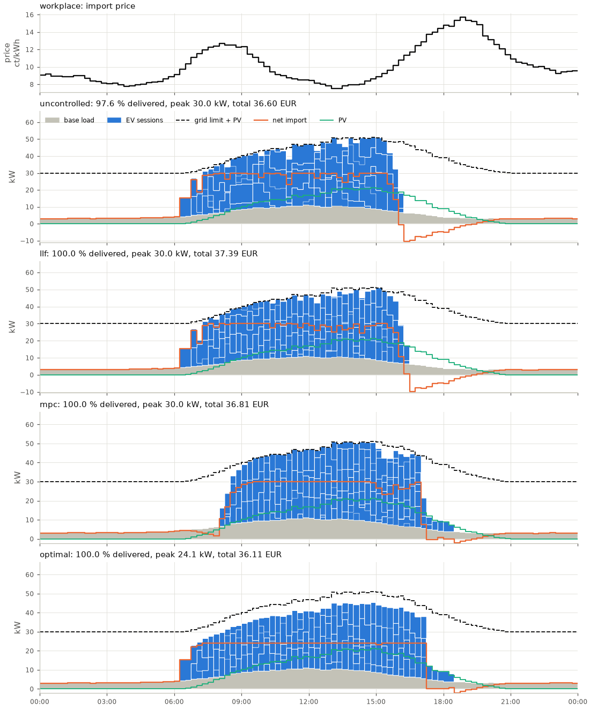
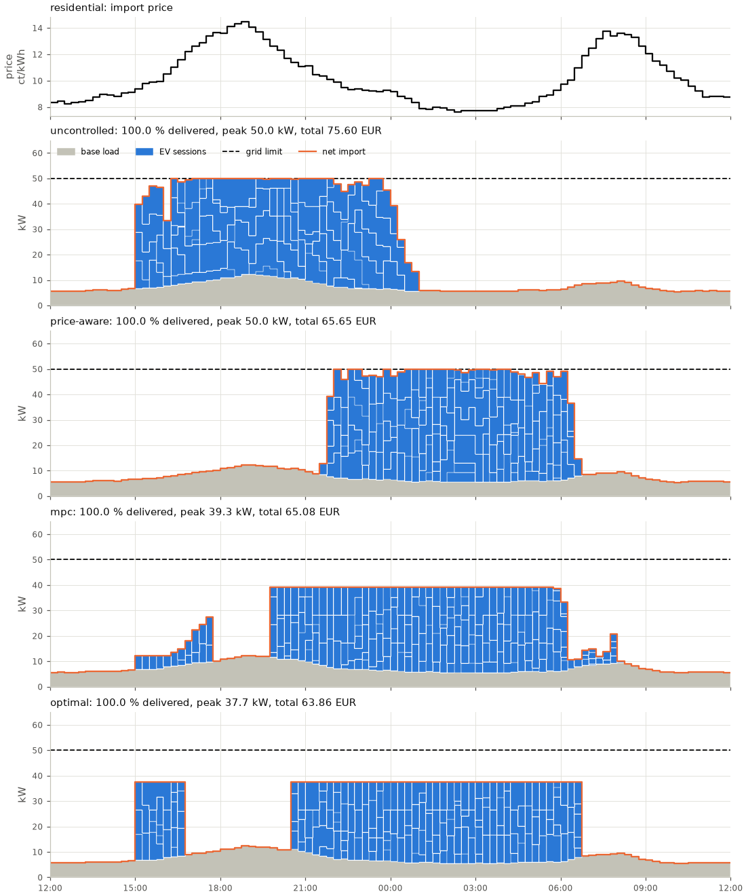
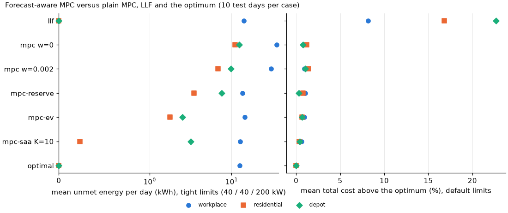

# Experiments

Every number on this page comes from running the command next to it in this repository on a
4-vCPU cloud VM (Python 3.12, NumPy 2.5, SciPy 1.18 with its bundled HiGHS). Scenarios are
seeded and HiGHS is deterministic, so costs and energies reproduce exactly with the same package
versions; wall times are indicative and depend on the machine and its load. The phase-aware
study is in [phases.md](phases.md) and the V2G study in [v2g.md](v2g.md).

## 1. Policies on the built-in scenarios

| policy | knows | rule |
|---|---|---|
| `uncontrolled` | connected EVs | full power on plug-in; when a limit is hit, earlier arrivals keep full power (static load balancer, FCFS) |
| `equal-share` | connected EVs | water-filling split of the capacity; if not every EV can get the minimum, the least-served EVs go first, so access rotates |
| `edf` | + declared departures | earliest departure first, each up to full power |
| `llf` | + declared energy | least laxity first; laxity = time left - time needed at full power |
| `price-aware` | + price, base-load and PV forecasts | EVs in least-laxity order book the cheapest free capacity in their window, re-planned every step |
| `mpc` | + everything declared so far | solves the LP/MILP from now to the last known departure and applies the first step |
| `mpc-reserve`, `mpc-ev`, `mpc-saa` | + an arrival forecast | MPC with a capacity reserve, expected ghost EVs, or sampled futures (section 2) |
| `optimal` | **all sessions in advance** | one LP/MILP over the whole horizon, replayed: the benchmark, not a deployable controller |

All heuristics allocate against the same capacity rows as the simulator (one per line on
phase-aware sites), never command a non-zero current below the 6 A minimum, and put setpoints
on the charger's resolution.


The numbers below are pasted from runs of the commands shown, at commit time, with seed 7. The
scenarios are seeded and HiGHS is deterministic, so the same package versions reproduce them
exactly. Each command takes about 2 to 4 s in the development container. Costs are site-level:
they include the base load, so the differences between rows are what matter. `gap %` is the
penalised cost above the LP lower bound.

**Workplace**: 40 EVs, arrivals mostly 07:00 to 09:30, about 8 h dwell, 60 kW connection:

```text
$ evcharge compare --scenario workplace --sessions 40 --seed 7 --grid-limit 60
scenario workplace | 40 sessions on 40 chargers | 295.7 kWh requested | grid limit 60.0 kW | base load peak 11.0 kW | 2026-04-15 00:00 + 24 h @ 15 min | demand charge 0.30 EUR/kW

policy        delivered %  unmet kWh  done %  energy EUR  peak kW  demand EUR  total EUR  gap %   Jain  util %  viol
------------  -----------  ---------  ------  ----------  -------  ----------  ---------  -----  -----  ------  ----
uncontrolled       100.00       0.00   100.0       46.30     60.0       18.00      64.30  10.81  1.000    50.9     0
equal-share        100.00       0.00   100.0       46.51     60.0       18.00      64.51  11.17  1.000    50.9     0
edf                100.00       0.00   100.0       46.32     60.0       18.00      64.32  10.84  1.000    50.9     0
llf                100.00       0.00   100.0       46.41     60.0       18.00      64.41  11.00  1.000    50.9     0
price-aware        100.00       0.00   100.0       42.09     60.0       18.00      60.09   3.55  1.000    50.9     0
mpc                100.00       0.00   100.0       44.89     46.1       13.82      58.71   1.17  1.000    50.9     0
optimal            100.00       0.00   100.0       46.12     39.7       11.91      58.03   0.01  1.000    50.9     0

lower bound (LP relaxation, perfect foresight): 58.03 EUR
```

**Depot**: 40 vans back from about 17:00, out again from about 06:00, 45 kWh median request,
22 kW chargers, 240 kW connection:

```text
$ evcharge compare --scenario depot --sessions 40 --seed 7
scenario depot | 40 sessions on 40 chargers | 1807.2 kWh requested | grid limit 240.0 kW | base load peak 21.0 kW | 2026-04-15 12:00 + 24 h @ 15 min | demand charge 0.30 EUR/kW

policy        delivered %  unmet kWh  done %  energy EUR  peak kW  demand EUR  total EUR  gap %   Jain  util %  viol
------------  -----------  ---------  ------  ----------  -------  ----------  ---------  -----  -----  ------  ----
uncontrolled       100.00       0.00   100.0      256.46    240.0       72.00     328.46  22.23  1.000    52.5     0
equal-share        100.00       0.00   100.0      257.49    240.0       72.00     329.49  22.61  1.000    52.5     0
edf                100.00       0.00   100.0      256.01    240.0       72.00     328.01  22.06  1.000    52.5     0
llf                100.00       0.00   100.0      257.86    240.0       72.00     329.86  22.75  1.000    52.5     0
price-aware        100.00       0.00   100.0      203.04    240.0       72.00     275.04   2.35  1.000    52.5     0
mpc                100.00       0.00   100.0      217.95    181.2       54.35     272.30   1.33  1.000    52.5     0
optimal            100.00       0.00   100.0      212.55    187.3       56.18     268.73   0.00  1.000    52.5     0

lower bound (LP relaxation, perfect foresight): 268.73 EUR
```

**Residential**: 40 apartments, arrivals 15:00 to 23:00, departures 06:00 to 09:00, 50 kW
connection shared with the building's base load:

```text
$ evcharge compare --scenario residential --sessions 40 --seed 7
scenario residential | 40 sessions on 40 chargers | 337.9 kWh requested | grid limit 50.0 kW | base load peak 12.3 kW | 2026-04-15 12:00 + 24 h @ 15 min | demand charge 0.30 EUR/kW

policy        delivered %  unmet kWh  done %  energy EUR  peak kW  demand EUR  total EUR  gap %   Jain  util %  viol
------------  -----------  ---------  ------  ----------  -------  ----------  ---------  -----  -----  ------  ----
uncontrolled       100.00       0.00   100.0       60.60     50.0       15.00      75.60  18.38  1.000    51.0     0
equal-share        100.00       0.00   100.0       60.64     50.0       15.00      75.64  18.44  1.000    51.0     0
edf                100.00       0.00   100.0       60.49     50.0       15.00      75.49  18.21  1.000    51.0     0
llf                100.00       0.00   100.0       60.58     50.0       15.00      75.58  18.35  1.000    51.0     0
price-aware        100.00       0.00   100.0       50.65     50.0       15.00      65.65   2.81  1.000    51.0     0
mpc                100.00       0.00   100.0       53.30     39.3       11.78      65.08   1.90  1.000    51.0     0
optimal            100.00       0.00   100.0       52.57     37.7       11.30      63.86   0.00  1.000    51.0     0

lower bound (LP relaxation, perfect foresight): 63.86 EUR
```

**Scarce capacity with PV**: the same workplace behind a 30 kW connection with 40 kWp of PV.
Here *who* charges matters more than *when*:

```text
$ evcharge compare --scenario workplace --sessions 40 --seed 7 --grid-limit 30 --pv-kwp 40
scenario workplace | 40 sessions on 40 chargers | 295.7 kWh requested | grid limit 30.0 kW | PV peak 21.2 kW | base load peak 11.0 kW | 2026-04-15 00:00 + 24 h @ 15 min | demand charge 0.30 EUR/kW

policy        delivered %  unmet kWh  done %  energy EUR  peak kW  demand EUR  total EUR    gap %   Jain  util %  viol
------------  -----------  ---------  ------  ----------  -------  ----------  ---------  -------  -----  ------  ----
uncontrolled        97.62       7.03    95.0       27.60     30.0        9.00      36.60  1949.60  0.998    73.4     0
equal-share         96.68       9.80    75.0       27.37     30.0        9.00      36.37  2717.42  0.996    72.6     0
edf                100.00       0.00   100.0       28.35     30.0        9.00      37.35     3.48  1.000    75.1     0
llf                100.00       0.00   100.0       28.39     30.0        9.00      37.39     3.59  1.000    75.1     0
price-aware        100.00       0.00   100.0       28.05     30.0        9.00      37.05     2.65  1.000    75.1     0
mpc                100.00       0.00   100.0       27.81     30.0        9.00      36.81     1.99  1.000    75.1     0
optimal            100.00       0.00   100.0       28.87     24.1        7.23      36.11     0.04  1.000    75.1     0

lower bound (LP relaxation, perfect foresight): 36.09 EUR
```

What the numbers show:

- With enough energy capacity, every policy delivers 100 %, and the difference is money. The
  deadline heuristics save nothing over uncontrolled charging (10 to 23 % above the bound). Price
  awareness recovers most of the energy cost, and only the optimisation-based policies also
  lower the **peak**, which is what the demand charge bills.
- MPC stays within 2 % of the clairvoyant optimum while seeing only EVs that have plugged in. In
  the workplace runs MPC even pays *less for energy* than the optimum, but more in total: the
  optimum accepts dearer energy to hold a lower peak, because it knows the final demand.
- When capacity is scarce, the ordering matters. FCFS and equal share leave EVs short at
  departure (75 to 95 % of sessions completed), while every deadline-aware policy completes
  all of them. The large `gap %` of the first two rows comes from the 100 EUR/kWh unmet-energy
  penalty in the penalised cost.



*`evcharge plot --scenario workplace --sessions 40 --seed 7 --grid-limit 30 --pv-kwp 40
--policies uncontrolled llf mpc optimal --output docs/workplace-pv.png`: stacked base load
(grey) and EV sessions (blue), net import (orange) and the grid limit plus PV (dashed).
Uncontrolled charging is capped at the 30 kW import limit but serves arrival order, not
deadlines. The optimum holds a flat 24 kW peak and soaks up the PV.*



*`evcharge plot --scenario residential --sessions 40 --seed 7 --policies uncontrolled
price-aware mpc optimal --output docs/residential.png`: uncontrolled charging lands on the
evening price and load peak. Price-aware charging moves to the night but saturates the
connection. MPC and the optimum fill the night valley under a flat, lower peak.*

## 2. Does an arrival forecast make MPC robust?

Plain MPC sees only the EVs that are plugged in. Under scarce capacity it postpones energy into
cheap slots that later arrivals will also need, and it ends runs short where the
work-conserving LLF delivers everything. Three forecast-aware variants
([`evcharge.policies.forecast`](../src/evcharge/policies/forecast.py)) plan for the EVs that
have not arrived yet:

- **`mpc-reserve`**: plain MPC, but the expected load of future arrivals (each at its uniform
  rate over its window) is taken out of the capacity of later steps. A heuristic.
- **`mpc-ev`**: the *expected* future fleet is added to the problem as continuous "ghost" loads
  (fractional EVs aggregated per hour of arrival and departure): the certainty-equivalent
  controller.
- **`mpc-saa`**: `K = 10` future days are sampled and solved jointly with one shared first step
  for the connected EVs and scenario-specific decisions afterwards (non-anticipativity), a
  sample-average approximation of the two-stage stochastic program
  ([theory.md](theory.md#the-value-of-information-and-forecast-aware-mpc)).

The forecast is an `ArrivalForecast` fitted to **30 training days** per case, generated with
reserved seeds 1,000,000 to 1,000,029; the **test days are seeds 1 to 10**, so no test day is
in the training data. It is a kernel-smoothed bootstrap of the training sessions (arrival,
departure, energy, power), with the day's session count drawn from the training days' counts.
The variants use a quick-charge weight of 0: the forecast replaces the regulariser.

```text
$ python examples/forecast_mpc.py --csv runs.csv                  # about 1 hour
$ python examples/forecast_mpc.py --figure docs/figures/forecast-mpc.png --from runs.csv
```

"runs short" counts days that left more than 0.01 kWh undelivered; "delivered % (min)" is the
worst day; "cost / optimum" is the mean of total cost (energy + demand charge) over the
optimum's, which drops below 1 when a policy saves money by delivering less; "gap to LP bound"
is the mean penalised cost (total cost plus 100 EUR per undelivered kWh) above the LP lower
bound. Runtime is the median wall time of one simulated day (96 control steps). The runs shared
the VM with other jobs (1-minute load average 6 to 7), so the runtimes are indicative only.

**Default grid limits** (40 EVs, 10 test days per row):

| case | policy | runs short | unmet kWh (mean) | delivered % (min) | cost / optimum | gap to LP bound % | runtime s (median) |
|---|---|---:|---:|---:|---:|---:|---:|
| workplace 60 kW | llf | 0/10 | 0.0 | 100.0 | 1.082 | 8.2 | 0.0 |
| workplace 60 kW | mpc w=0 | 0/10 | 0.0 | 100.0 | 1.008 | 0.8 | 3.6 |
| workplace 60 kW | mpc w=0.002 | 0/10 | 0.0 | 100.0 | 1.009 | 0.9 | 3.7 |
| workplace 60 kW | mpc-reserve | 0/10 | 0.0 | 100.0 | 1.011 | 1.1 | 3.4 |
| workplace 60 kW | mpc-ev | 0/10 | 0.0 | 100.0 | 1.009 | 0.9 | 4.2 |
| workplace 60 kW | mpc-saa K=10 | 0/10 | 0.0 | 100.0 | 1.006 | 0.6 | 29.9 |
| workplace 60 kW | optimal | 0/10 | 0.0 | 100.0 | 1.000 | 0.0 | 0.3 |
| residential 50 kW | llf | 0/10 | 0.0 | 100.0 | 1.168 | 16.8 | 0.0 |
| residential 50 kW | mpc w=0 | 0/10 | 0.0 | 100.0 | 1.012 | 1.2 | 5.2 |
| residential 50 kW | mpc w=0.002 | 0/10 | 0.0 | 100.0 | 1.014 | 1.4 | 5.7 |
| residential 50 kW | mpc-reserve | 0/10 | 0.0 | 100.0 | 1.008 | 0.8 | 5.1 |
| residential 50 kW | mpc-ev | 0/10 | 0.0 | 100.0 | 1.007 | 0.7 | 5.4 |
| residential 50 kW | mpc-saa K=10 | 0/10 | 0.0 | 100.0 | 1.004 | 0.4 | 46.5 |
| residential 50 kW | optimal | 0/10 | 0.0 | 100.0 | 1.000 | 0.0 | 0.4 |
| depot 240 kW | llf | 0/10 | 0.0 | 100.0 | 1.227 | 22.7 | 0.0 |
| depot 240 kW | mpc w=0 | 0/10 | 0.0 | 100.0 | 1.008 | 0.8 | 4.2 |
| depot 240 kW | mpc w=0.002 | 0/10 | 0.0 | 100.0 | 1.011 | 1.1 | 5.0 |
| depot 240 kW | mpc-reserve | 0/10 | 0.0 | 100.0 | 1.003 | 0.3 | 4.1 |
| depot 240 kW | mpc-ev | 0/10 | 0.0 | 100.0 | 1.007 | 0.7 | 4.2 |
| depot 240 kW | mpc-saa K=10 | 0/10 | 0.0 | 100.0 | 1.004 | 0.4 | 33.2 |
| depot 240 kW | optimal | 0/10 | 0.0 | 100.0 | 1.000 | 0.0 | 0.2 |

**Tight grid limits:**

| case | policy | runs short | unmet kWh (mean) | delivered % (min) | cost / optimum | gap to LP bound % | runtime s (median) |
|---|---|---:|---:|---:|---:|---:|---:|
| workplace 40 kW | llf | 3/10 | 14.1 | 82.4 | 1.002 | 4.4 | 0.0 |
| workplace 40 kW | mpc w=0 | 9/10 | 35.7 | 73.8 | 0.950 | 2038.4 | 3.0 |
| workplace 40 kW | mpc w=0.002 | 9/10 | 30.3 | 77.5 | 0.964 | 1551.6 | 2.9 |
| workplace 40 kW | mpc-reserve | 6/10 | 13.6 | 83.8 | 1.001 | 48.6 | 3.2 |
| workplace 40 kW | mpc-ev | 6/10 | 14.5 | 83.8 | 0.998 | 278.4 | 3.3 |
| workplace 40 kW | mpc-saa K=10 | 4/10 | 12.8 | 83.8 | 1.003 | 13.1 | 24.7 |
| workplace 40 kW | optimal | 3/10 | 12.6 | 83.9 | 1.000 | 0.0 | 0.2 |
| residential 40 kW | llf | 0/10 | 0.0 | 100.0 | 1.079 | 7.9 | 0.0 |
| residential 40 kW | mpc w=0 | 6/10 | 11.1 | 85.2 | 0.995 | 1432.9 | 5.5 |
| residential 40 kW | mpc w=0.002 | 4/10 | 6.8 | 87.8 | 1.003 | 857.4 | 5.5 |
| residential 40 kW | mpc-reserve | 5/10 | 3.5 | 93.1 | 1.005 | 435.2 | 5.8 |
| residential 40 kW | mpc-ev | 4/10 | 1.8 | 96.5 | 1.001 | 220.0 | 5.2 |
| residential 40 kW | mpc-saa K=10 | 1/10 | 0.2 | 99.5 | 1.009 | 29.6 | 45.0 |
| residential 40 kW | optimal | 0/10 | 0.0 | 100.0 | 1.000 | 0.0 | 0.3 |
| depot 200 kW | llf | 0/10 | 0.0 | 100.0 | 1.142 | 14.2 | 0.0 |
| depot 200 kW | mpc w=0 | 9/10 | 12.3 | 95.4 | 1.003 | 402.8 | 5.1 |
| depot 200 kW | mpc w=0.002 | 5/10 | 9.8 | 95.4 | 1.006 | 317.9 | 4.9 |
| depot 200 kW | mpc-reserve | 6/10 | 7.6 | 97.5 | 1.000 | 250.1 | 4.5 |
| depot 200 kW | mpc-ev | 6/10 | 2.5 | 99.4 | 1.002 | 83.5 | 4.7 |
| depot 200 kW | mpc-saa K=10 | 5/10 | 3.2 | 99.2 | 1.003 | 106.2 | 38.8 |
| depot 200 kW | optimal | 0/10 | 0.0 | 100.0 | 1.000 | 0.0 | 0.2 |



*Left: mean unmet energy per day at the tight limits (symmetric-log axis; 0 at the left edge).
Right: mean total cost above the optimum at the default limits.*

### What the numbers say

- **With enough capacity the forecast barely matters.** Every MPC variant stays within 0.3 to
  1.4 % of the clairvoyant optimum and never ends a day short; LLF pays 8 to 23 % more. SAA is
  the closest (0.4 to 0.6 %) at six to eight times the runtime of plain MPC.
- **Under tight limits the forecast helps a lot, but does not close the gap.** On the tight
  residential garage, mean unmet energy falls from 11.1 kWh per day (plain MPC, `w = 0`) to
  3.5 (`mpc-reserve`), 1.8 (`mpc-ev`) and 0.2 kWh (`mpc-saa`), and the days ending short from
  6 to 1 in 10. On the tight depot it falls from 12.3 to 2.5 (`mpc-ev`) and 3.2 kWh (`mpc-saa`).
  On the tight workplace, even the optimum is short on 3 of 10 days (12.6 kWh on average); the
  forecast variants come within 0.2 to 1.9 kWh of that, against 35.7 kWh for plain MPC.
- **LLF is still the most robust controller at the tight limits.** It delivers everything on
  the residential and depot days, where every forecast-aware variant still ends 1 to 6 days in
  10 short,
  and on the workplace days it is within 1.5 kWh of the optimum. Its price is 8 to 23 % more
  cost whenever capacity is sufficient.
- **The expected-value controller is not enough on its own.** `mpc-ev` plans for an average
  day; on a day with more (or later, or larger) arrivals than average it has committed too
  little energy early. SAA hedges against that spread and is the best forecast-aware variant
  on the workplace and residential cases, but not on the depot (5 days short against 6 for
  `mpc-ev`, and slightly more unmet energy).

Why the forecast-aware variants still fall short: the forecast is **unconditional** (it does
not update the expected number of later arrivals from the arrivals seen so far today), ghosts
are fluid (no minimum current), and ten samples are few for the tail. Conditioning the forecast
on the day so far, a chance-constrained or robust reserve, or a fallback to least-laxity
ordering when the plan's slack runs out are natural next steps; none of them is implemented.
