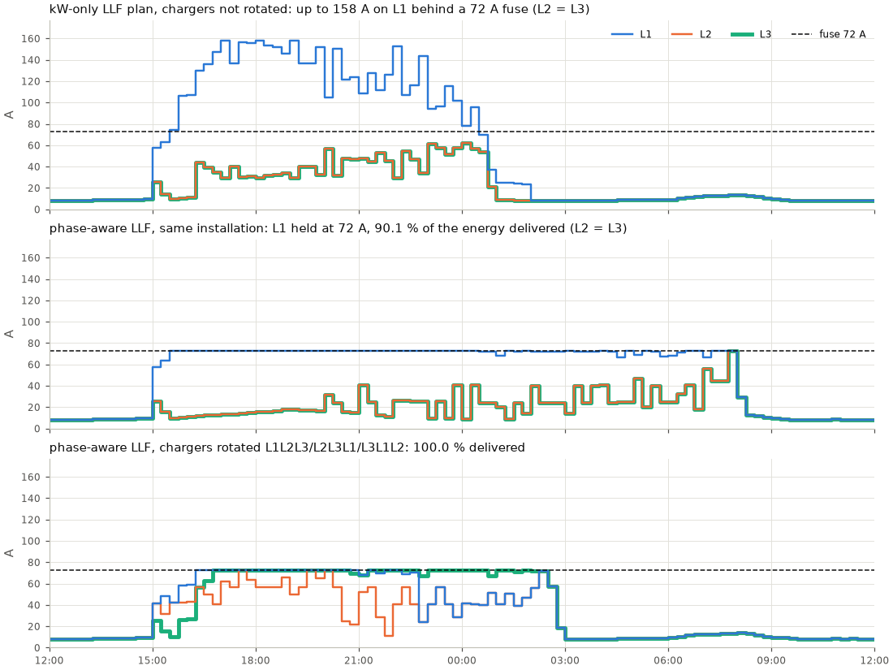

# Phase-aware charging

A site's grid connection is not a kW number. It is three lines, L1, L2 and L3, each behind a
main fuse (or breaker, cable rating or contractual limit) in amperes. A controller that only
knows the site's kW limit can respect that limit and still overload a line, because a
single-phase EV puts all its current on one line (TN) or one pair of lines (IT). This page
describes how `evcharge` models that, what it guarantees, and what the difference is worth on a
realistic garage. The proofs are in [theory.md](theory.md#the-phase-model).

## The electrical model

| | TN (230/400 V, with neutral) | IT (230 V between lines, no neutral) |
|---|---|---|
| Where | most of Europe; newer Norwegian installations | older Norwegian homes and garages |
| Single-phase EV | line-to-neutral: loads **one** line | line-to-line: loads **two** lines with the same current |
| Two-phase EV | two lines | not supported (depends on the charger's neutral-pin wiring) |
| Three-phase EV | three lines | three lines |
| kW per ampere of setpoint | 0.23 / 0.46 / 0.69 (1/2/3 phases) | 0.23 (1 phase), 0.398 (3 phases) |
| 16 A gives | 3.7 kW, 7.4 kW, 11 kW | 3.7 kW, 6.4 kW |

Many three-phase EVs cannot use three phases on an IT supply at all and fall back to
single-phase, line-to-line charging. Model such an EV as `phases=1`.

- **Setpoints are amperes per phase**, the unit IEC 61851 PWM and OCPP `SetChargingProfile`
  (`chargingRateUnit: "A"`) use. The range is the charger's minimum (6 A) up to the lowest of
  the charger, cable and on-board-charger limits, on the charger's resolution
  (`current_step_a`: 0.1 A by default, as OCPP 1.6 limits carry one decimal; many EVs follow in
  whole amperes, so 1 A is a realistic setting). The site's kW limit still applies to the
  total power.
- **Phase rotation.** A charger's `rotation` lists the site line of each of its conductors, for
  example `L2L3L1`. An EV that uses one phase draws on the charger's first conductor, so
  installing chargers with rotated phases spreads single-phase EVs over the lines. The OCPP
  `ConnectorPhaseRotation` names (`RST`, `STR`, `TRS`, and the reversed `RTS`, `SRT`, `TSR`)
  are accepted.
- **Line currents are linear.** A session with setpoint `I` adds `I` to every line it loads.
  Base load and PV are given per line in amperes (`base_current_a`, `pv_current_a`), or derived
  from the kW series as balanced three-phase currents at unity power factor.
- **Every constraint is a row.** At each step and for each line there is one row
  `base + sum of EV currents on the line <= fuse` (TN also credits PV current, see below), plus
  the site's kW row. The simulator enforces the rows, heuristics allocate against them, and the
  LP/MILP contains them. The aggregate kW model is the special case of a single row.

### What the linear model guarantees

- **Loads only (no PV, no V2G): conservative for any phase angles.** The true line current
  is the magnitude of the phasor sum of the device currents, which is at most the sum of their
  magnitudes (triangle inequality). The model uses that sum, so it never under-estimates. It is
  exact when all currents on a line are in phase, as for unity-power-factor EVs on TN.
- **TN with PV: exact for collinear currents.** On TN, loads and a PV inverter at unity power
  factor on the same line are in phase or in anti-phase with that line's voltage, so the
  signed sum is exact and PV current is credited against loads.
- **IT: no credit for PV.** On IT grids the line-to-line devices on L1 are at +30° (pair
  L1-L2), -30° (pair L1-L3) or 0° (three-phase) from the line reference, so an injection does
  not cancel a load on another pair. The model therefore requires the load current alone to
  stay within the fuse and gives PV no credit. That is conservative, and it is rigorous for
  unity-power-factor devices (see [theory.md](theory.md#the-phase-model) for the 60° argument).

The same rows hold on commands and on what EVs draw: an EV that finishes early only lowers
the load current.

### Rounding to the charger's grid

A continuous optimum cannot be sent to a charger with 0.1 A or 1 A steps. `evcharge` handles
this without losing energy in practice:

- Line rows are rounded down to the finest resolution of the sessions on them. Their left-hand
  side is always on that grid, so no executable schedule is excluded: the LP bound stays valid
  and gets tighter.
- The offline optimum solves a rounding MILP after the LP/MILP: every setpoint may move to grid
  values within one step of its floor or ceiling, under the same rows and objective. It stops
  at a 1 % gap, so results do not depend on the machine's speed. The plan is then on the grid,
  and the replay is exact.
- MPC (and any policy that calls `finalize`) rounds its first step down and trims the most
  flexible setpoints until every row holds. Where the rows allow, it rounds up, in this order:
  a session finishing in its last step, a session whose loss cannot be made up later, then the
  nearest grid value. If needed, it lowers one flexible session by a step to make room.

## The demonstration: a garage with many single-phase EVs

A residential garage: 40 EVs arriving 15:00 to 23:00 and leaving next morning, half of them
single-phase 16 A cars, the others three-phase 16 or 32 A cars. The kW limit is 50 kW, and the
main fuse is sized so that a *balanced* load reaches it exactly (72 A on TN, 126 A on IT). A
kW-only controller therefore sees nothing wrong. `PhaseBlind(LeastLaxityFirst())` is LLF run
on the kW-only view of the site; its setpoints are converted to amperes.



*`python examples/phase_imbalance.py --figure docs/figures/phase-imbalance.png`: the TN garage.
Top: the kW-only plan puts every single-phase EV on L1 (all chargers are wired L1L2L3) and draws
up to 158 A on a 72 A line; the fuse would trip. Middle: phase-aware LLF on the same
installation holds L1 at the fuse and delivers 90.1 % of the energy, because L1 is the
bottleneck. Bottom: with cyclic phase rotation of the chargers the same controller delivers
everything.*

The full comparison (`python examples/phase_imbalance.py`, a few minutes; seed 7). "Plan before
protection" is the kW-only plan with nothing stopping it. The first row is what happens when the
simulator enforces the line limit on the kW-only commands. It acts like a crude protective load
balancer: it scales every command on the overloaded line down in proportion, and chargers
pushed below 6 A pause. "Line cuts" counts those corrections.

**TN, not rotated**: fuse 72 A per line, kW limit 50.0 kW

| policy | max L1 / L2 / L3 (A) | delivered % | unmet kWh | total EUR | line cuts |
|---|---|---:|---:|---:|---:|
| llf (kW only) | 72 / 72 / 72 | 24.2 | 256.2 | 44.22 | 65 |
| llf (kW only), plan before protection | **158 / 62 / 62** | - | - | - | - |
| llf | 72 / 72 / 72 | 90.1 | 33.4 | 67.68 | 0 |
| equal-share | 72 / 42 / 42 | 93.2 | 23.1 | 64.86 | 0 |
| mpc | 72 / 72 / 72 | 90.4 | 32.3 | 66.33 | 0 |
| optimal | 72 / 72 / 72 | 96.8 | 10.8 | 68.38 | 0 |

**TN, rotated**: fuse 72 A per line, kW limit 50.0 kW

| policy | max L1 / L2 / L3 (A) | delivered % | unmet kWh | total EUR | line cuts |
|---|---|---:|---:|---:|---:|
| llf (kW only) | 72 / 72 / 72 | 99.0 | 3.3 | 72.65 | 68 |
| llf (kW only), plan before protection | **111 / 72 / 126** | - | - | - | - |
| llf | 72 / 72 / 72 | 100.0 | 0.0 | 73.78 | 0 |
| equal-share | 72 / 72 / 72 | 100.0 | 0.1 | 74.85 | 0 |
| mpc | 72 / 72 / 72 | 100.0 | 0.0 | 65.06 | 0 |
| optimal | 72 / 67 / 72 | 100.0 | 0.0 | 64.21 | 0 |

**IT, not rotated**: fuse 126 A per line, kW limit 50.0 kW

| policy | max L1 / L2 / L3 (A) | delivered % | unmet kWh | total EUR | line cuts |
|---|---|---:|---:|---:|---:|
| llf (kW only) | 126 / 126 / 95 | 97.8 | 7.4 | 70.88 | 61 |
| llf (kW only), plan before protection | **179 / 179 / 98** | - | - | - | - |
| llf | 126 / 126 / 94 | 100.0 | 0.0 | 70.04 | 0 |
| equal-share | 125 / 125 / 88 | 98.8 | 3.9 | 70.26 | 0 |
| mpc | 126 / 126 / 59 | 100.0 | 0.0 | 64.93 | 0 |
| optimal | 126 / 126 / 60 | 100.0 | 0.0 | 64.18 | 0 |

**IT, rotated**: fuse 126 A per line, kW limit 50.0 kW

| policy | max L1 / L2 / L3 (A) | delivered % | unmet kWh | total EUR | line cuts |
|---|---|---:|---:|---:|---:|
| llf (kW only) | 125 / 125 / 125 | 98.5 | 5.1 | 72.52 | 71 |
| llf (kW only), plan before protection | **173 / 147 / 159** | - | - | - | - |
| llf | 126 / 126 / 126 | 100.0 | 0.0 | 72.38 | 0 |
| equal-share | 125 / 125 / 125 | 99.6 | 1.3 | 73.25 | 0 |
| mpc | 126 / 126 / 125 | 100.0 | 0.0 | 64.91 | 0 |
| optimal | 125 / 122 / 124 | 100.0 | 0.0 | 64.18 | 0 |

What the numbers show:

- **A kW limit that "looks fine" overloads lines.** The kW-only plan stays within 50 kW
  throughout, yet it would draw 2.2 times the fuse current on L1 (TN, not rotated) and 1.4 to
  1.7 times on the other installations. Phase rotation does not remove the risk: EVs arrive at
  random chargers, so the single-phase load is never perfectly balanced.
- **Protection after the fact is not control.** Cutting the kW-only commands per line (the
  first row) keeps the fuse intact but delivers only 24 % of the energy on the unbalanced TN
  site, because proportional cuts push many EVs below 6 A.
- **Phase-aware control uses what the lines allow.** Every phase-aware policy keeps every line
  within its limit (0 cuts). On the unbalanced TN site L1 is a real bottleneck, and even the
  perfect-foresight optimum delivers 96.8 %: control cannot create capacity.
- **Installation matters as much as software.** Rotating the chargers' phases lets the same LLF
  controller deliver everything on TN. On IT, a single-phase EV spreads over two lines and the
  fuse is larger for the same kW, so all phase-aware policies deliver 100 % even without
  rotation.

## Using it

Python:

```python
from evcharge import Charger, Scenario, Session, Site, simulate
from evcharge.electrical import GridType, Supply

site = Site(
    grid_limit_kw=40.0,
    chargers=(
        Charger("P1", 22.0, max_current_a=32, rotation="L1L2L3"),
        Charger("P2", 22.0, max_current_a=32, rotation="L2L3L1"),
        Charger("P3", 7.4, phases=1, rotation="L3L1", max_current_a=32, current_step_a=1.0),
    ),
    supply=Supply.uniform(63.0, grid=GridType.IT),
)
# sessions: Session(..., phases=1, max_current_a=16) for a single-phase 16 A car
```

Synthetic scenarios and the CLI take `grid="TN"|"IT"`, `line_limit_a`, `rotate_phases` and
`single_phase_share`:

```bash
evcharge compare --scenario residential --sessions 40 --grid IT --single-phase-share 0.5 --no-rotation
evcharge run --input examples/garage-it.json     # an IT garage with an unbalanced base load
```

The JSON format of the `supply` block, the phase fields and per-line currents is in
[input-format.md](input-format.md#phase-aware-sites). `Scenario.aggregate()` gives the kW-only
view of a phase-aware scenario; `PhaseBlind(policy)` runs any policy as a phase-blind load
balancer.

## Limitations

- Unity power factor is assumed for EVs, base load and PV. Reactive base loads make the TN
  PV credit slightly optimistic. The size of the error is bounded in
  [theory.md](theory.md#the-phase-model).
- No automatic 1-phase/3-phase switching (some chargers switch to single-phase for PV-surplus
  charging), and the neutral conductor is not constrained (in TN-C-S installations the PEN is
  not fused).
- EVs are assumed to draw exactly the commanded current and to respond within the step. Real
  EVs follow in about 1 A steps, some ignore values between 6 and 7 A, and some go to sleep
  after long pauses.
- Two-phase EVs on IT grids are rejected rather than guessed.
