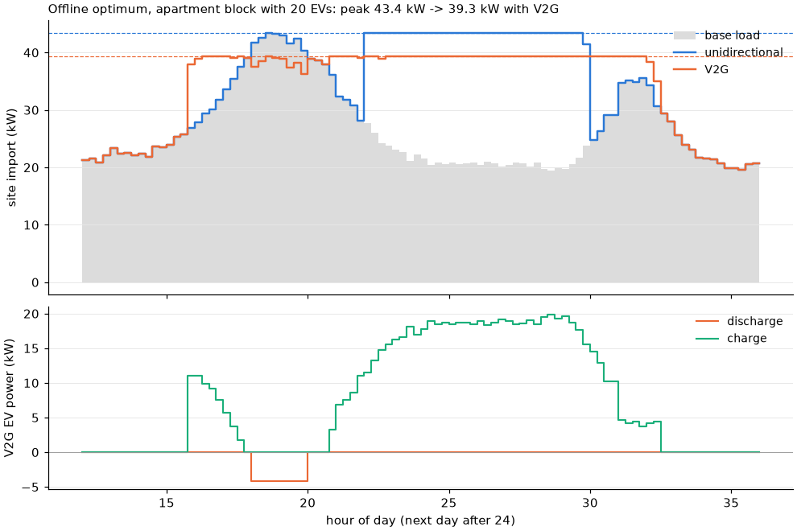

# Bidirectional charging (V2G)

A bidirectional charger can also *discharge* an EV into the site. This page describes how
`evcharge` models that, what the optimisation and the simulator guarantee, and what V2G is
worth against unidirectional smart charging on the built-in scenarios. The short answer: with
realistic battery wear and today's price shapes, **little**, except where the site pays a high
demand charge for a peak that the EVs do not cause themselves. The model and the LP are in
[theory.md](theory.md#bidirectional-charging).

## The model

A session with a `V2G` spec is modelled by its battery energy, not by an energy request:

| field | meaning |
|---|---|
| `capacity_kwh` | usable battery capacity |
| `initial_kwh` | energy at arrival |
| `min_kwh` | floor the aggregator may discharge to (the driver's reserve) |
| `max_kwh` | ceiling while plugged in; the EV's battery management stops charging there |
| `max_discharge_kw` / `max_discharge_current_a` | discharge limit (default and upper bound: the charge limit) |
| `discharge_efficiency` | battery-to-grid efficiency; the session's `efficiency` is grid-to-battery |
| `degradation_eur_per_kwh` | wear cost per kWh of battery throughput, **both directions** |

The EV must leave with at least `initial_kwh + energy_kwh` (so `energy_kwh` may be 0: "leave
as full as you came"). It discharges only on a charger with `bidirectional=True`; negative
setpoints mean discharge, with the same minimum current (6 A) and resolution as charging.

- **Battery trajectory.** `e[t] = e[t-1] + eta_c * P+[t] * dt - P-[t] * dt / eta_d`, with
  `min_kwh <= e[t] <= max_kwh` in every step. The LP carries `e` as variables; the simulator
  tracks it, stops charging at the ceiling and clips a discharge that would cross the floor
  (a `soc-limit` violation).
- **Export rows.** A bidirectional site gets export rows next to its import rows: the export
  limit in kW (`Site.export_limit_kw`, default the import limit) and, on phase-aware sites, the
  line limit for injected current. Discharge is credited against import in kW and, on TN grids,
  per line (collinear currents). On IT grids it gets no per-line credit, for the same reason PV
  gets none ([phases.md](phases.md#what-the-linear-model-guarantees)). Charging is never
  credited against export, so an EV that stops early can only lower export.
- **Costs.** Discharged energy earns the export price (`Tariff.export_price_eur_per_kwh`;
  the built-in scenarios pay the spot price, without the grid fee). Wear is charged on every
  kWh into and out of the battery. `total EUR` in the tables includes wear.
- **No simultaneous charge and discharge.** The MILP has one binary per direction with
  `y+ + y- <= 1`; the LP relaxation may do both, which only weakens its lower bound.
- **What the heuristics do.** EDF, LLF, equal share and price-aware stay unidirectional by
  design. The offline optimum, MPC and the forecast-aware MPC variants use discharge.

Hypothesis properties check, for random sites with random V2G sessions (aggregate and
phase-aware, TN and IT), that no policy violates a battery bound or any import or export row,
that every setpoint is on its grid, and that the LP bound is below every policy's cost
(`tests/test_properties.py`).

## The study

`examples/v2g_value.py` compares every scenario with its **unidirectional twin**
(`Scenario.unidirectional()`: same EVs, same batteries and targets, chargers that cannot
discharge), so the only difference is the ability to discharge. Every EV gets an illustrative
battery (40 to 77 kWh by EV type, arriving 30 to 70 % full, usable range 20 to 90 %,
discharge efficiency 0.9) and every charger is bidirectional. Four cases, five seeds each:

- **ev-peak**: the default residential garage (40 EVs, 50 kW connection), where the overnight
  EV charging sets the peak;
- **building-peak**: 20 EVs in an apartment block whose evening load sets the peak
  (`base_load_peak_kw=60`, 80 kW connection), demand charge 0.3 EUR/kW per day;
- **building-peak-high-dc**: the same with 1.0 EUR/kW per day;
- **volatile**: ev-peak with the spot price's deviations from its daily mean tripled.

The default wear, 0.04 EUR/kWh of throughput, is an assumption: roughly 120 EUR/kWh of pack
cost over 3,000 kWh of throughput per kWh of capacity. The wear sweep shows how the result
depends on it. The charging needed for driving costs the same wear in both variants, so a
saving is net of the *extra* wear of cycling.

```text
$ python examples/v2g_value.py                                   # about 20 minutes
$ python examples/v2g_value.py --figure docs/figures/v2g-peak-shaving.png
```

**Default wear (0.04 EUR/kWh), mean [min, max] over seeds 1 to 5.** Savings are total cost
(energy + demand charge + wear) of the unidirectional run minus the bidirectional run of the
*same* policy, in EUR per day for the whole site.

| case | uni total EUR (optimal) | V2G saving (optimal) | saving % | peak kW uni -> V2G | discharged kWh | extra wear EUR | V2G saving (mpc) | V2G saving (mpc-ev) |
|---|---:|---:|---:|---:|---:|---:|---:|---:|
| ev-peak | 81.36 | 0.00 [-0.00, 0.00] | 0.0 | 39.9 -> 39.9 | 0.0 | -0.00 | -0.08 [-0.73, 0.61] | 0.23 [-0.17, 0.58] |
| building-peak | 113.15 | 0.32 [-0.04, 1.01] | 0.3 | 47.2 -> 44.1 | 4.2 | 0.37 | 0.36 [-0.32, 1.20] | 0.60 [-0.56, 1.33] |
| building-peak-high-dc | 146.18 | 3.54 [2.32, 6.82] | 2.4 | 47.2 -> 42.1 | 8.1 | 0.72 | -4.16 [-5.94, -1.70] | 4.45 [1.76, 6.69] |
| volatile | 71.42 | 1.62 [0.53, 3.88] | 2.3 | 49.0 -> 50.0 | 43.2 | 3.84 | 0.06 [-1.89, 3.39] | 1.42 [-0.09, 3.06] |

The largest unmet energy of any of these 120 runs was 0.17 kWh.

**Offline-optimal V2G saving, EUR per day (mean discharged kWh), by wear cost:**

| case | 0 EUR/kWh | 0.02 EUR/kWh | 0.04 EUR/kWh | 0.08 EUR/kWh |
|---|---:|---:|---:|---:|
| ev-peak | 0.34 (24) | -0.00 (0) | 0.00 (0) | -0.00 (0) |
| building-peak | 1.53 (81) | 0.48 (5) | 0.32 (4) | 0.09 (2) |
| building-peak-high-dc | 4.37 (10) | 3.85 (8) | 3.54 (8) | 2.84 (7) |
| volatile | 8.85 (118) | 4.42 (81) | 1.62 (43) | 0.01 (2) |



*`python examples/v2g_value.py --figure docs/figures/v2g-peak-shaving.png`: building-peak-high-dc,
seed 1, offline optimum. Top: site import with charge-only chargers (blue) and with V2G
(orange) over the base load (grey), dashed lines at the two peaks. Bottom: the V2G run's EV
power. The EVs discharge about 4 kW through the evening peak, which lowers the day's peak
from 43.4 to 39.3 kW, and recharge overnight under that lower peak.*

### What the numbers say

- **Where the EVs set the peak, V2G is worth nothing.** In the default garage the optimum does
  not discharge at all: every kWh sent back must be bought again later, pays wear twice and
  loses 15 to 21 % in the round trip (charging efficiency 0.88 to 0.94 times 0.9), and the peak it would shave is the EVs'
  own charging, which smart charging already flattens. Even with free wear, V2G saves 0.34 EUR
  per day for 40 EVs.
- **Peak shaving pays only where the peak is someone else's and the demand charge is high.**
  With a building evening peak and 1.0 EUR/kW per day, V2G cuts the peak by about 5 kW and
  saves 3.54 EUR per day (2.4 %, about 0.18 EUR per EV per day), from only 8 kWh discharged.
  Because it cycles so little energy, this value is robust to wear (2.84 EUR at 0.08 EUR/kWh).
  At 0.3 EUR/kW per day the same shave is worth 0.32 EUR.
- **Arbitrage needs volatile prices and cheap wear.** With tripled price swings, V2G trades
  43 kWh at default wear for 1.62 EUR per day, of which 3.84 EUR of extra wear is already
  deducted. At 0.08 EUR/kWh the arbitrage disappears.
- **A controller without a forecast can lose money with V2G.** Plain MPC on
  building-peak-high-dc ends with a *higher* peak with V2G than without (47.1 against 44.3 kW
  on seed 1) and pays 4.16 EUR per day more on average: it spends battery energy and recharges
  without knowing that more EVs are still to arrive and add to the night's load. The
  forecast-aware `mpc-ev` (arrival forecast from 30 training days with reserved seeds) plans
  for the later arrivals and gains 4.45 EUR per day. That is more than the offline optimum's
  3.54 because the comparison is within each policy and `mpc-ev`'s unidirectional baseline
  is weaker than the optimum's. V2G does not help a controller that cannot see the rest of the
  night.

These are synthetic scenarios with illustrative prices, batteries and wear. The model has no
calendar ageing, no dependence of wear on state of charge or power, no inverter standby
losses, no reactive power, and no driver behaviour beyond a fixed departure target. It
supports conclusions about *when* V2G can pay in a site's own bill, not a business case.
